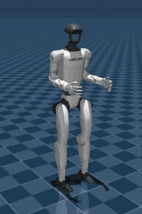

# Unitree G1: sentadilla y saludo en MuJoCo

Proyecto universitario completo y autónomo para mostrar una rutina sencilla
del robot bípedo Unitree G1. El robot hace una sentadilla, vuelve a levantarse,
saluda dos veces con el brazo derecho y regresa a la postura inicial.

<p align="center">
  
</p>

Está preparado para Windows y para una persona que recién recibe el proyecto.
No requiere el SDK de Unitree, CycloneDDS ni una conexión de red: solamente
Python, NumPy y MuJoCo.

## La forma más fácil de empezar

1. Hacé doble clic en `instalar.bat` una sola vez.
2. Cuando termine, hacé doble clic en `verificar.bat`.
3. Si todo aparece como `[OK]`, hacé doble clic en `iniciar_demo.bat`.

La ventana de MuJoCo se abre, ejecuta la rutina y se cierra al finalizar.

## Instalación manual

Desde PowerShell, dentro de esta carpeta:

```powershell
py -3 -m venv .venv
.\.venv\Scripts\python.exe -m pip install -e .
```

El modo editable (`-e`) permite cambiar el código dentro de `src` sin tener que
reinstalarlo después de cada modificación.

## Comandos útiles

```powershell
# Comprobar modelo, articulaciones y límites sin abrir una ventana
.\.venv\Scripts\python.exe -m uade_mujoco --check

# Ejecutar toda la rutina sin ventana y generar el CSV
.\.venv\Scripts\python.exe -m uade_mujoco --headless

# Abrir la demostración visual
.\.venv\Scripts\python.exe -m uade_mujoco

# Misma rutina con gravedad: los motores se mueven con un control PD de torque
.\.venv\Scripts\python.exe -m uade_mujoco --fisica

# Repetir la rutina tres veces
.\.venv\Scripts\python.exe -m uade_mujoco --repetir 3

# Ejecutar las pruebas automáticas
.\.venv\Scripts\python.exe -m unittest discover -s tests -v
```

## Qué genera

Después de ejecutar la rutina se crea
`resultados/trayectoria_g1.csv`. El archivo contiene:

- instante y fase de la rutina;
- altura de la base;
- ángulos objetivo y medidos de ambas rodillas;
- ángulos del hombro, codo y muñeca derechos.

## Cómo está organizado

```text
UADE-Mujoco/
├── src/uade_mujoco/          código principal del proyecto
│   ├── cli.py                argumentos y coordinación general
│   ├── config.py             posturas y tiempos que el alumno puede cambiar
│   ├── trajectory.py         interpolación de mínimo tirón
│   ├── model.py              carga y validación de MuJoCo
│   ├── runner.py             ejecución visual y sin ventana
│   ├── physics.py            modo con gravedad y control PD
│   ├── unitree/              simulador DDS y comandos para el robot real
│   ├── reporting.py          exportación del CSV
│   └── paths.py              rutas centralizadas
├── tests/                    pruebas automáticas
├── pruebas/                  un .bat por cada prueba en simulador y robot
├── docs/                     documentación paso a paso e imágenes
├── models/g1/                modelo oficial y mallas del G1
├── resultados/               archivos producidos al ejecutar
├── pyproject.toml            metadatos y dependencias
├── instalar.bat              crea el entorno e instala dependencias
├── verificar.bat             corre validaciones y pruebas
├── iniciar_demo.bat          abre la demostración
├── instalar_robot.bat        crea .venv-robot con el SDK de Unitree
└── unitree.bat               simulador DDS y comandos para el robot
```

Documentación recomendada:

- [Empezar desde cero](docs/EMPEZAR_DESDE_CERO.md)
- [Arquitectura del proyecto](docs/ARQUITECTURA.md)
- [Cómo modificar los movimientos](docs/CAMBIAR_MOVIMIENTOS.md)
- [Guía para la presentación](docs/GUIA_PRESENTACION.md)
- [Del simulador al robot físico](docs/ROBOT_FISICO.md)

## Idea técnica

Cada fase tiene una postura objetivo. La transición usa el polinomio de mínimo
tirón:

```text
s(u) = 10u³ - 15u⁴ + 6u⁵,   con 0 <= u <= 1
```

Esto evita arrancar o frenar de golpe. Antes de mostrar la rutina, el programa
comprueba que el modelo tenga 29 actuadores, que existan las articulaciones y
que todos los valores estén dentro de sus límites MJCF.

## Alcance y limitación

Por defecto es una **demostración cinemática educativa**: la gravedad se
desactiva y cada postura se asigna directamente, con los pies apoyados en el
suelo, para concentrar el trabajo en la generación de trayectorias.

Con `--fisica` la gravedad se activa y MuJoCo simula la dinámica: cada motor
recibe un torque `tau = kp·(q_objetivo − q) − kd·dq`. El robot se sostiene
porque la rutina mantiene el centro de masa sobre los pies y las rigideces son
muy altas (ver `physics.py`); con valores parecidos a los del robot real se
cae. No es un controlador de equilibrio, no es sim-to-real y no debe usarse
para enviar comandos a un robot físico.

Como ampliación futura se puede implementar un controlador de equilibrio que
permita usar rigideces realistas.

## Llevarlo al robot

`instalar_robot.bat` crea un segundo entorno (`.venv-robot`, con Python 3.10)
con el SDK de Unitree. Con él, `unitree.bat` ofrece un simulador que se
comunica por DDS igual que el G1 real y los comandos para enviarle la rutina:
el saludo por `arm_sdk` y la sentadilla con el controlador de Unitree. El paso
a paso, con las precauciones de seguridad, está en
[Del simulador al robot físico](docs/ROBOT_FISICO.md), y cada prueba tiene
su `.bat` en [pruebas](pruebas/README.md).

## Modelo y licencia

El MJCF y las mallas provienen del repositorio oficial `unitree_mujoco` de
Unitree Robotics. Su licencia BSD de 3 cláusulas está incluida en
`THIRD_PARTY_LICENSE_UNITREE.txt`.
